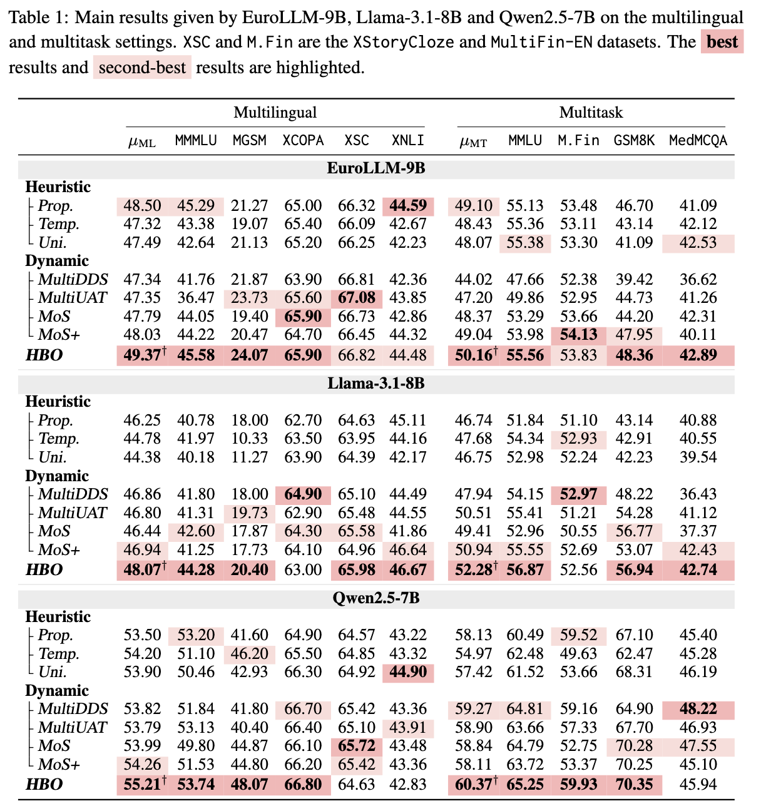
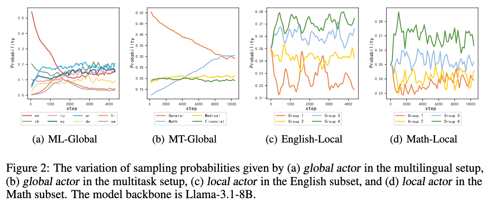
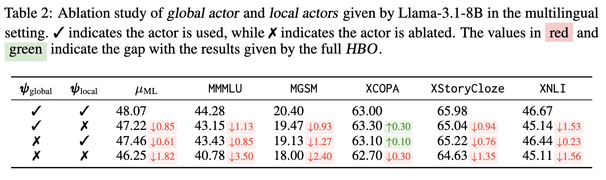
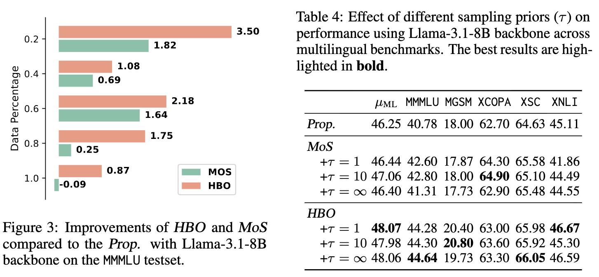
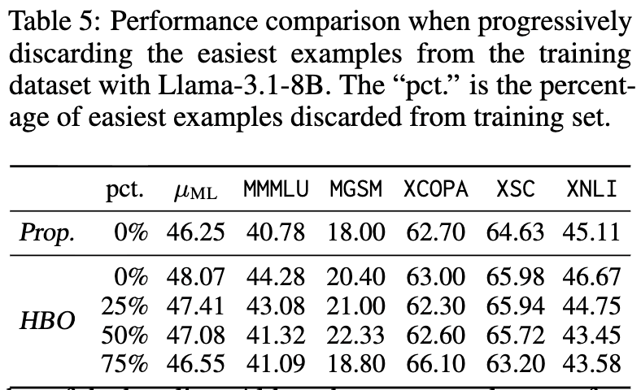

<h1 align=center>HBO: Hierarchical Balancing Optimization for Fine-Tuning Large Language Models</h1>

<h3 align=center>Weixuan Wang, Minghao Wu, Barry Haddow, Alexandra Birch


<h2 align=center>Abstract</h2>

Fine-tuning large language models (LLMs) on a mixture of diverse datasets poses challenges due to data imbalance and heterogeneity. Existing methods often address these issues across datasets (globally) but overlook the imbalance and heterogeneity within individual datasets (locally), which limits their effectiveness. We introduce **Hierarchical Balancing Optimization (HBO)**, a novel method that enables LLMs to autonomously adjust data allocation during fine-tuning both across datasets (globally) and within each individual dataset (locally). HBO employs a bilevel optimization strategy with two types of actors: a Global Actor, which balances data sampling across different subsets of the training mixture, and several Local Actors, which optimizes data usage within each subset based on difficulty levels. These actors are guided by reward functions derived from the LLM's training state, which measure learning progress and relative performance improvement. We evaluate HBO on three LLM backbones across nine diverse tasks in multilingual and multitask setups. Results show that HBO consistently outperforms existing baselines, achieving significant accuracy gains. Our in-depth analysis further demonstrates that both the global actor and local actors of HBO effectively adjust data usage during fine-tuning. HBO provides a comprehensive solution to the challenges of data imbalance and heterogeneity in LLM fine-tuning, enabling more effective training across diverse datasets.


<h2 align=center>Contribution</h2>

- We propose HBO, a novel hierarchical dynamic data sampling method that enables LLMs to **autonomously address data imbalance and heterogeneity during fine-tuning**. By leveraging a bilevel optimization framework with two types of actors, HBO dynamically adjusts sampling probabilities both **globally and locally**.

- We demonstrate the broad applicability and effectiveness of HBO across multiple LLM backbones and tasks. Through extensive experiments with **three model backbones over nine diverse tasks**, HBO consistently outperforms existing sampling strategies, achieving substantial accuracy improvements. Visualizations of the sampling probabilities reveal that HBO dynamically adjusts these probabilities in a **fascinating cyclical pattern**, highlighting its ability to adaptively focus on areas that enhance model learning.

- We conduct extensive analyses to investigate the contributions of the global and local actors, the robustness of HBO to varying sampling priors, the impact of data volume, and more. Additionally, we highlight **the critical role of incorporating easy example**s, which are often discarded during fine-tuning, in boosting model performance.


<h2 align=center>Methodology</h2>

<table align="center">
<tr>
  <td width="80%" align="center" valign="middle"></td>
</tr>
</table>


**The bilevel optimization framework of HBO.** **Global Actor** and **Local Actors** jointly adjust data sampling probabilities both globally (across datasets) and locally (within datasets) to optimize the LLM parameters. Based on the LLM's training state, the global reward and the local reward are computed to guide the optimization of the global and local actors, respectively.


**The Global Actor (Across Datasets)**
The Global Actor monitors the model's progress across the entire training mixture. If it sees the model is struggling with Chinese tasks but excelling at English tasks it automatically turns up the volume on the Chinese data.

**The Local Actors (Within Datasets)**
Every dataset in the mixture gets its own Local Actor. This actor breaks its dataset down by difficulty level. It ensures the model focuses on the "Goldilocks" data—not too easy, not too hard—to maximize the learning rate.

**Rewards and Bilevel Optimization**

HBO doesn't just guess; it uses a reward function derived from the LLM’s own training state.

It measures learning progress (how much the loss is dropping).

It measures relative performance improvement.

By using a bilevel optimization strategy, the actors (who choose the data) and the model (who learns from the data) work in a feedback loop. The actors are constantly trying to find the data that provides the highest reward (the most learning) for the model.


<h2 align=center>Experiments</h2>

<h3 align=center>Setups</h3>

<table align="center" align="center">
<tr align="center">
  <td width="50%" align="center" valign="middle">Multilingual Setup

  English, Arabic, German, Spanish, Hindi, Russian, Swahili, and Chinese.
  </td>
  <td width="50%" align="center" valign="middle">Multitask Setup
  
  General, Financial, Math, and Medical.
  </td>
</tr>
</table>

<h3 align=center>Main Results</h3>

**HBO consistently outperforms all the baselines in both multilingual and multitask setups.**

<table align="center">
<tr>
  <td width="80%" align="center" valign="middle"></td>
</tr>
</table>


<h3 align=center>Visualization Sampling Probabilities</h3>

**HBO can effectively balance the data allocation globally and locally.**


<table align="center">
<tr>
  <td width="80%" align="center" valign="middle"></td>
</tr>
</table>

<h2 align=center>Analysis</h2>

**Both global actor and local actors can effectively improve performance.**


<table align="center">
<tr>
  <td width="80%" align="center" valign="middle"></td>
</tr>
</table>


**HBO shows robust improvements across sampling priors and consistently outperforms the baselines even in resource-constrained environments.**


<table align="center">
<tr>
  <td width="80%" align="center" valign="middle"></td>
</tr>
</table>

**Easy examples matter for model performance.** To investigate the importance of easy examples in training, we progressively discard increasing percentages of the easiest training examples while maintaining the total training compute (e.g., doubling the number of training steps when 50% of examples were discarded).

<table align="center">
<tr>
  <td width="80%" align="center" valign="middle"></td>
</tr>
</table>


<h2 align=center>Conclusion</h2>

In this paper, we present **Hierarchical Balancing Optimization (HBO)**, a novel hierarchical dynamic data sampling method designed to tackle the critical challenges of data imbalance and heterogeneity in fine-tuning LLMs. Leveraging a bilevel optimization framework with a **Global Actor** and several **Local Actors**, HBO enables LLMs to autonomously adjust data sampling both across datasets (globally) and within datasets (locally) based on their current training state. Through extensive experiments across three LLMs and nine tasks in multilingual and multitask setups, we demonstrate the effectiveness of HBO , achieving significant performance improvements. By autonomously adapting LLMs’ learning strategies, HBO represents a significant advancement in addressing the complexities of dataset mixture balancing, contributing to more effective fine-tuning of LLMs.


<h2 align=center>Bibtex</h2>

```
@article{wang2025hbo,
  title={HBO: Hierarchical Balancing Optimization for Fine-Tuning Large Language Models},
  author={Wang, Weixuan and Wu, Minghao and Haddow, Barry and Birch, Alexandra},
  journal={arXiv preprint arXiv:2505.12300},
  year={2025}
}
```
